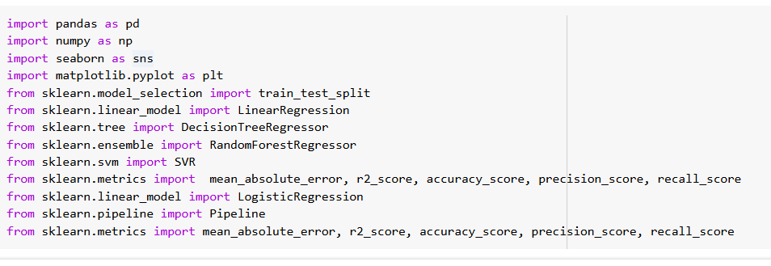
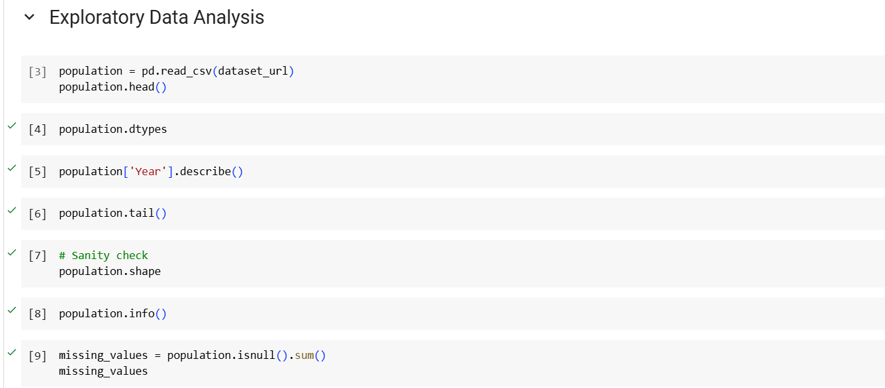
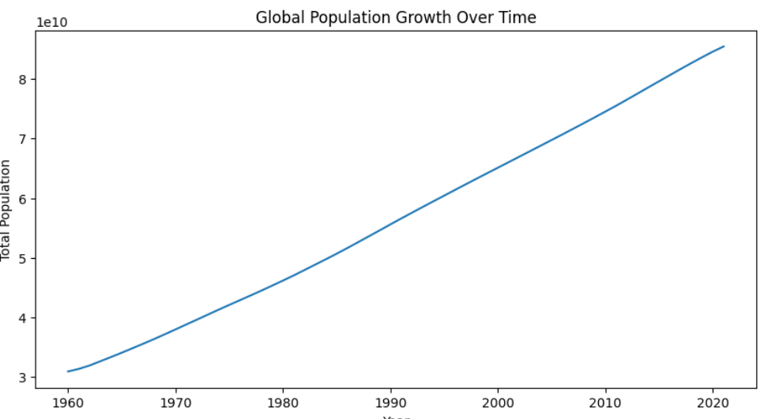
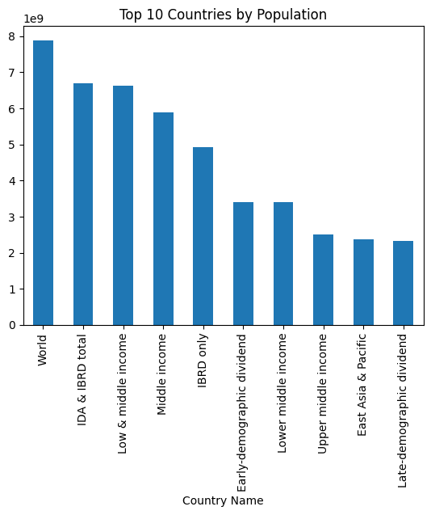
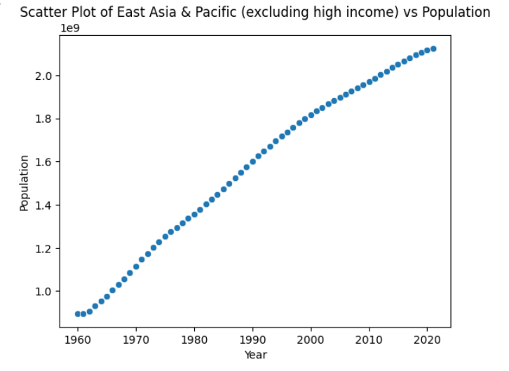

# Population figures for countries, regions (e.g. Asia) and the world

Global Population Analysis

This project studies how populations have changed over time across different countries and regions. Using a large dataset with population information from many countries over several decades, we aim to identify trends in population growth, understand the impact of economic and social factors, and explore how these trends differ around the world.

## Dataset Description

The data comes from the World Bank and includes population numbers for many countries every year from 1960 to today. Key pieces of information in the dataset are “Country Name,” “Country Code,” “Year,” and “Population.” This data lets us explore how populations in different parts of the world have grown or changed over time.

## Summary of Findings

Our findings show that population trends differ greatly by region. In areas like Sub-Saharan Africa and South Asia, populations are growing quickly, while in more developed areas like Europe, growth is slower or even declining. Generally, countries with stronger economies tend to have slower growth due to factors like urbanization and lower birth rates. In contrast, countries with developing economies often experience faster growth, largely driven by higher birth rates.

## Data Preprocessing
Necessary import libraries

Preferences

During data processing, the dataset was loaded using pd.read_csv and went through multiple preparation procedures to ensure it was ready for analysis. Initial processes, including population.head(), population.tail(), and population.info(), helped identify data types and confirm consistency across rows and columns. Summary statistics of the "Year" column provided a time range overview, and missing values were checked with population.isnull().sum() to detect any gaps needing interpolation or imputation. Duplicates were identified and removed using population.duplicated().sum(), ensuring unbiased results. Lastly, unique country names were retrieved with population['Country Name'].unique() to verify global coverage. These steps prepared the data by eliminating inconsistencies, addressing missing values, and confirming regional scope for thorough analysis.

## Exploratory Data Analysis

### Visualization

We designed charts to help us identify patterns and trends better. Line charts illustrated how population numbers varied over time, bar charts compared regions, and scatter plots indicated how various factors influenced population increase. These images assisted us in better understanding the data and identifying links between different variables. 

  
The graph shows that the world’s population grew steadily from about 3 billion in 1960 to around 8 billion by 2020. This growth is mainly due to lower death rates, longer life spans, high birth rates in some regions, and slower drops in birth rates overall. This trend is expected to continue, though growth may slow down in some places.

The bar chart depicts the population sizes of various groups and countries, with the global population being the greatest, followed by World Bank members, low- and middle-income countries, and others. This chart highlights how most of the world’s population is grouped in specific regions and economic categories, though rankings could change over time due to shifting population trends.  

  

The scatter plot shows that the population in East Asia and the Pacific steadily grew from 1960 to 2020. This growth is primarily due to fewer deaths, greater life expectancy, and high birth rates, but birth rates have slowed in some places, such as China. Each dot represents the population for a specific year, and the smooth climb over time indicates continuous growth without large surges. In the future, the population is expected to keep growing, but more slowly.

  

The chart shows how the populations of China and India grew steadily from 1960 to 2020, with China's growth rate staying steady and India’s rising more quickly toward the end, suggesting India might soon become the world’s most populous country. This growth is due to lower death rates, people living longer, and historically high birth rates, though policies like China’s one-child rule have slowed growth there in recent years.

## Model Development

This model's development process went through the selection of several machine learning algorithms and was trained over historical data to predict population growth. To start, the dataset was preprocessed by removing all missing values and creating a binary target variable representing the population growth. Use of Multiple Models applied such as Logistic Regression, Decision Tree, Random Forest, and Linear Regression. All of these models were trained on the training data so that the models could learn the patterns and relationships between the input features, such as Year, and the target variable, population growth. 

Split Data into Train and Test Sets:

## Model Evaluation

LogisticRegression
Model Accuracy: 92.04%
Model Precision: 92.04%
Model Recall: 100.00%
Decision Tree - Model Accuracy: 92.01% 
Decision Tree - Model Precision: 92.80% 
Decision Tree - Model Recall: 99.01% 
Random Forest - Model Accuracy: 92.01% 
Random Forest - Model Precision: 92.80% 
Random Forest - Model Recall: 99.01% 
Linear Regression - Model Accuracy: 92.04% 
Linear Regression - Model Precision: 92.04% 
<<<<<<< HEAD
Linear Regression - Model Recall: 100.00%  

The evaluation results reflect that all the models predicted population growth with a strong performance. The Logistic Regression model had 92.04% in terms of accuracy, along with precision and recall rates of 92.04% and 100.00%, respectively. That means, that although the model is very accurate, it is especially good at discovering true growth instances without failing to recognize any (because of perfect recall).  

Both the Decision Tree and Random Forest models reached 92.01%. However, the precision actually proved to be slightly bigger (92.80%) and the corresponding recall to be less grand for these tree-based techniques than the Logistic Regression. In short, their ability to decrease false positives was quite much better, though sensitivity values remain relatively high.  

=======
Linear Regression - Model Recall: 100.00%

The evaluation results reflect that all the models predicted population growth with a strong performance. The Logistic Regression model had 92.04% in terms of accuracy, along with precision and recall rates of 92.04% and 100.00%, respectively. That means, that although the model is very accurate, it is especially good at discovering true growth instances without failing to recognize any (because of perfect recall).
Both the Decision Tree and Random Forest models reached 92.01%. However, the precision actually proved to be slightly bigger (92.80%) and the corresponding recall to be less grand for these tree-based techniques than the Logistic Regression. In short, their ability to decrease false positives was quite much better, though sensitivity values remain relatively high.
>>>>>>> 083f10574910cecbb7fc58573d73cb35a84c104c
This Linear Regression model was adjusted for application within this binary classification, however it remained able to project the findings of Logistic Regression with a 92.04% accuracy and precision and had an absolute recall of 100.00%.
Overall, these results illustrate how all the models can appropriately characterize population growth curves, especially in terms of precision and recall, and are thus likely to be successfully used in predictions with real data.

## Conclusion

In conclusion, this final project provides population growth analysis of the whole world, where some regions dominate owing to economic and social factors. During data preprocessing and visualization, changes in population over time and unique regional and economic population dynamics was explored. Different models of machine learning, including Logistic Regression, Decision Trees, Random Forests, and Linear Regression, were built and tested. All the models showed a good fit in predicting population growth. The Logistic Regression model performed well with a high recall, meaning it was good at detecting instances of population growth, while the Decision Tree and Random Forest models provided a slightly better precision to reduce false positives. To the researcher, policymaker, and economist, this logistic regression model may be more valuable in helping make informed decisions and planning for a more sustainable future.

Reference the Dataset: https://datahub.io/core/population?fbclid=IwY2xjawGJO4ZleHRuA2FlbQIxMAABHTbe8Q__nbu9jnwduB92JXX8aj5E1wg73kl1rFDOGSeB98l5SSPT_sJVRQ_aem_7jgC_1x4WnwXtLER93PFzA

<<<<<<< HEAD
## Contributors
=======
## Contributors
>>>>>>> 083f10574910cecbb7fc58573d73cb35a84c104c
